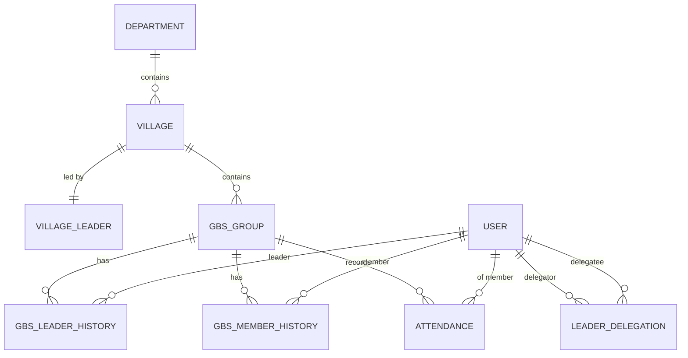

# 출석부 웹 서비스 – Product Requirements Document (PRD)
*버전 1.0 · 2025‑04‑20*

---

## 1. 목적 / 배경
대학부 리더들이 매주 조원(학생) 출석을 간편하게 기록하고, 마을장·교역자가 데이터를 열람·관리할 수 있도록 하는 **웹 기반 출석 관리 시스템**을 구축한다.  
GBS 조편성은 6개월마다 재편되므로 **구성 히스토리**와 과거 출석 데이터의 영속성을 필수로 보장한다.

---

## 2. 이해관계자 & 주요 역할

| 구분 | 권한 요약 | 핵심 니즈 |
|------|-----------|-----------|
| **교역자 (Minister)** | 대학부 전체 데이터 **읽기** | 전체 출석 현황·통계 확인, 문제 그룹 식별 |
| **마을장 (Village Leader)** | 자기 마을 데이터 **조회·수정** | 소속 GBS별 출석률 관리 |
| **리더 (GBS Leader)** | 자기 GBS 출석 **입력**<br/>+ 위임받은 GBS 입력 | 모바일/PC에서 빠른 입력, 위임 관리 |
| **조원 (Member)** | 시스템 직접 사용 X | 본인 출석을 간접 관리 |
| **시스템 관리자** | 사용자·조직 구조 초기 세팅 | 계정 프로비저닝, 배치 작업 |

---

## 3. 범위 (스코프)

### 3.1 핵심 기능
1. **인증·인가**: Spring Security + JWT; RBAC(역할 기반 접근 제어)  
2. **조직 관리**  
   - 부서 > 마을 > GBS > 조원 계층 구조 유지  
   - GBS/리더/조원 배치 **6 개월 단위 히스토리** 저장  
3. **출석 입력**  
   - 리더용 주간 입력 폼  
     - 대예배 O/X, 큐티 0‑6, 대학부 A/B/C  
     - 일괄 입력, 자동 임시저장, 제출 후 잠금  
4. **권한 위임**  
   - 리더 → 다른 리더 : 위임 등록·해지, 감사 로그  
5. **데이터 조회·수정**  
   - 마을장 : 마을 전체 주간 리스트·그래프, 수동 수정  
   - 교역자 : 필터(부서·기간·GBS) + 엑셀/CSV 다운로드  
6. **통계·리포트 (MVP+)**  
   - 주간/월간 출석률, 큐티 평균, 미출석 알람 API  
7. **감사 로그 & 히스토리**  
   - 위임, 재편성, 수동 수정 이벤트 기록

### 3.2 제외 (v1)
- 모바일 PWA / 오프라인 모드  
- 알림 (Email·SMS) 자동화  
- SSO (OAuth2) 연동  

---

## 4. 사용자 흐름

### 4.1 리더
```
로그인 → 대시보드(이번 주) → “출석 입력”
        ↳ 조원 리스트
            • 대예배 O/X
            • 큐티 0‑6
            • 대학부 A/B/C
        → 저장 → “완료” 표시
        → (선택) 위임 관리 → 대상 리더 검색 → 위임/해지
```

### 4.2 마을장
```
로그인 → 마을 대시보드
        ↳ 주간 출석 테이블 + 필터
        ↳ 그래프(출석률 추세)
        → [편집] 클릭 시 동일 폼
```

### 4.3 교역자
```
로그인 → 부서 선택 → 전체 통계
        ↳ 피벗 테이블 / 그래프
        ↳ 엑셀 다운로드
```

---

## 5. 데이터 모델 (ERD 요약)



### 5.1 주요 테이블

| Table | 주요 컬럼 (PK 굵게) | 설명 |
|-------|--------------------|------|
| **user** | **id**, name, birth_date, role(enum: MINISTER/V_LEADER/LEADER/MEMBER), department_id | 모든 사용자 |
| **department** | **id**, name |
| **village** | **id**, name, department_id |
| **village_leader** | **user_id**(PK, FK user.id), village_id, start_dt, end_dt |
| **gbs_group** | **id**, name, village_id, term_start_dt, term_end_dt |
| **gbs_leader_history** | **id**, gbs_id, leader_id(user), start_dt, end_dt |
| **gbs_member_history** | **id**, gbs_id, member_id(user), start_dt, end_dt |
| **leader_delegation** | **id**, delegator_id, delegatee_id, gbs_id, start_dt, end_dt, created_at |
| **attendance** | **id**, member_id, gbs_id, week_start, worship(enum O/X), qt_count(0‑6), ministry(enum A/B/C), created_by, created_at |

**인덱스**
- `attendance (gbs_id, week_start)`
- `leader_delegation (delegatee_id, gbs_id, end_dt)`

---

## 6. API 초안 (REST)

| Method | URL | 권한 | 설명 |
|--------|-----|------|------|
| **GET** | `/api/v1/attendance?gbsId=&week=` | 리더+ | 주간 조회 |
| **POST** | `/api/v1/attendance` | 리더 | 출석 일괄 저장 |
| **POST** | `/api/v1/delegations` | 리더 | 위임 생성 |
| **PATCH** | `/api/v1/delegations/{id}/revoke` | 리더 | 위임 해지 |
| **GET** | `/api/v1/villages/{id}/attendance?week=` | 마을장 | 마을 전체 |
| **GET** | `/api/v1/departments/{id}/report?range=` | 교역자 | 통계 |

---

## 7. 비‑기능 요구사항 (NFR)

| 항목 | 요구값 |
|------|--------|
| **아키텍처** | Spring Boot 3 (Kotlin), React 18, MySQL 8.0 |
| **호환성** | 최신 Chrome·Safari·Edge |
| **보안** | JWT + Refresh‑Token, HTTPS, OWASP Top‑10 대비 |
| **감사** | 모든 데이터 변경 → Audit Trail 테이블 |
| **성능** | 1 초 미만 응답(p95) / 동시 사용자 300 |
| **배포** | Kubernetes + Helm, GitOps(ArgoCD) |
| **백업** | MySQL PITR, S3 Snapshot |

---

## 8. 향후 로드맵 (MVP 이후)

1. **알림 서비스**: 미출석 자동 리마인더 (Slack·SMS)  
2. **모바일 PWA**: 오프라인 임시 저장 → 동기화  
3. **현황 대시보드**: 실시간 WebSocket 차트  
4. **SSO**(OIDC): 교회 계정 통합 로그인  
5. **BI 리포트**: Data Warehouse + Grafana

---

## 9. 승인

| 역할 | 이름 | 상태 | 일시 |
|------|------|------|------|
| PM | 홍길동 | ✅ | 2025‑04‑20 |
| Tech Lead | 김개발 | ✅ | 2025‑04‑20 |
| 교역자 대표 | 박교역 | ⏳ | — |

> *실제 ERD 파일(`church_attendance.mwb`)과 React 컴포넌트 명세는 설계 단계 2에서 별도 제공 예정.*
